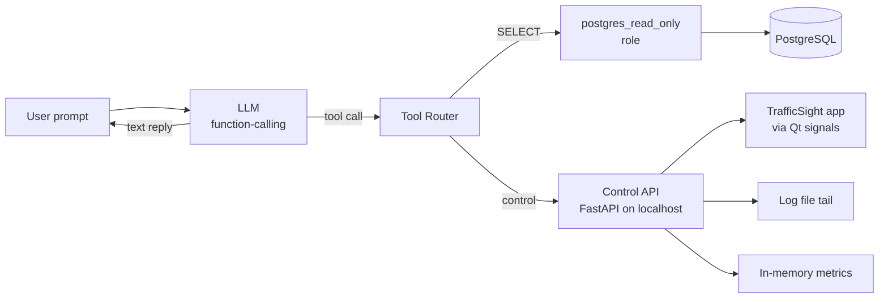

# TrafficSight — AI Agent Specification

> A formal specification for an LLM-based agent that talks to TrafficSight
> through its PostgreSQL database and (optionally) a control API.

---

## 1. Why an Agent?

TrafficSight produces two tables (`detections`, `line_crossings`) that
answer most traffic questions an operator or researcher might ask. But
writing SQL by hand is friction:

- *"Berapa sepeda motor yang lewat Sugeng Jeroni tadi pagi?"*
- *"Show me all overspeed trucks on the east arm in the last hour."*
- *"Switch the dashboard to the Wirosaban camera and pause it."*

An LLM agent that can translate natural language → SQL → result, and that
can send control commands to the running app, turns TrafficSight from a
passive recorder into an interactive analyst. This document specifies the
agent's contract with the system: what it can read, what it can write,
what tools it has, and how it must stay safe.

## 2. Personas

| Persona       | Uses the agent for                                                |
|---------------|-------------------------------------------------------------------|
| Traffic ops   | Natural-language queries during a live incident                   |
| Researcher    | Ad-hoc analysis without writing SQL                               |
| Maintainer    | Health checks ("is the stream up?", "last error in log?")         |
| Demo / pitch  | Show off the system to non-technical stakeholders                 |

The agent is **read-mostly**: 95 % of interactions are queries. The few
mutating actions (pause stream, switch camera, recalibrate) are
privileged and require explicit human confirmation.

## 3. Capability Matrix

| Capability                        | Default | Requires confirmation | Notes                                              |
|-----------------------------------|---------|-----------------------|----------------------------------------------------|
| Read `detections` table           | ✅      | No                    |                                                    |
| Read `line_crossings` table       | ✅      | No                    |                                                    |
| Read run-time metrics (FPS, etc.) | ✅      | No                    | Via control API `/metrics`                         |
| Read log tail                     | ✅      | No                    | Last 200 lines                                     |
| Switch active camera              | ❌      | Yes                   | Mutates UI state                                   |
| Pause / resume stream             | ❌      | Yes                   | Mutates UI state                                   |
| Reload line config                | ❌      | Yes                   | Reloads `counting_lines.json`                      |
| Trigger recalibration             | ⛔      | Always blocked        | Out of scope — operator-only GUI                   |
| Insert / update / delete rows     | ⛔      | Always blocked        | DB user is read-only for the agent                 |

## 4. Architecture



Three independent surfaces:

1. **PostgreSQL (read-only role)** — the agent connects with a
   `trafficsight_reader` DB role that has `SELECT` on both tables and
   nothing else.
2. **Control API (localhost FastAPI)** — a small HTTP service exposing
   `/metrics`, `/logs`, `/stream/switch`, `/stream/pause`. Mutating
   endpoints require a one-time token and a human-in-the-loop
   confirmation step.
3. **Log file tail** — read-only filesystem access to `trafficSight.log`.

The agent never imports `trafficsight.*` Python code. It only talks to
the two surfaces above. This keeps the agent process isolated and lets
the app crash or restart without affecting the agent.

## 5. Tools (function-calling schema)

The agent is given the following tools. Each tool's arguments are
JSON-Schema-validated before invocation.

### 5.1 `query_detections`

```jsonc
{
  "name": "query_detections",
  "description": "Run a read-only SQL query against the detections table.",
  "parameters": {
    "type": "object",
    "properties": {
      "sql": {
        "type": "string",
        "description": "A single SELECT statement. Must start with 'SELECT'."
      },
      "limit": {
        "type": "integer",
        "default": 100,
        "maximum": 1000
      }
    },
    "required": ["sql"]
  }
}
```

**Safety**: the tool pre-parses `sql` with `sqlparse` and rejects any
statement that is not a single `SELECT`. The connection role
`trafficsight_reader` has no `INSERT`/`UPDATE`/`DELETE` grants as a
defence-in-depth measure.

### 5.2 `query_line_crossings`

Same shape as `query_detections`, but the connection targets the
`line_crossings` table. Kept as a separate tool so the LLM's prompt can
carry per-table schema hints.

### 5.3 `get_metrics`

```jsonc
{
  "name": "get_metrics",
  "description": "Return the current run-time metrics of the TrafficSight app.",
  "parameters": { "type": "object", "properties": {} }
}
```

Returns:

```json
{
  "camera": "Sugeng Jeroni 2",
  "fps": 24.7,
  "buffer": 32,
  "delay_seconds": 1.3,
  "target_fps": 25.0,
  "unique_detections": 47,
  "overspeed_count": 3,
  "unique_crossings": 12,
  "per_arm": {
    "Utara": {"masuk": 4, "keluar": 3},
    "Selatan": {"masuk": 2, "keluar": 0},
    "Barat": {"masuk": 1, "keluar": 2},
    "Timur": {"masuk": 0, "keluar": 0}
  }
}
```

### 5.4 `tail_logs`

```jsonc
{
  "name": "tail_logs",
  "description": "Return the last N lines of the TrafficSight log file.",
  "parameters": {
    "type": "object",
    "properties": {
      "lines": { "type": "integer", "default": 100, "maximum": 500 }
    }
  }
}
```

### 5.5 `switch_camera`

```jsonc
{
  "name": "switch_camera",
  "description": "Switch the running TrafficSight dashboard to a different camera.",
  "parameters": {
    "type": "object",
    "properties": {
      "camera_name": {
        "type": "string",
        "enum": ["Sugeng Jeroni 2", "Simpang Wirosaban Barat", "Simpang Pingit"]
      }
    },
    "required": ["camera_name"]
  }
}
```

This is a **mutating** action: the control API returns a `confirmation`
URL, the human opens it in a browser, and only then does the switch
execute. The agent must surface the URL to the user rather than executing
silently.

### 5.6 `pause_stream` / `resume_stream`

```jsonc
{
  "name": "pause_stream",
  "description": "Pause the live video render loop. Detection continues for buffered frames.",
  "parameters": { "type": "object", "properties": {} }
}
```

Same confirmation flow as `switch_camera`.

## 6. System Prompt Skeleton

The agent runs with a system prompt along these lines:

```
You are the TrafficSight analyst agent. You help operators and researchers
query live and historical traffic data from the city of Yogyakarta's ATCS
cameras.

You have access to two tables:
- detections(id, timestamp, camera, track_id, class_name, speed_kmh, cx, cy, direction, is_overspeed)
- line_crossings(id, timestamp, camera, track_id, class_name, speed_kmh, direction)

direction in detections is one of: "↑ Utara", "↓ Selatan", "← Barat", "→ Timur", "Diam".
direction in line_crossings is "{arm}-{masuk|keluar}", e.g. "Utara-masuk".

Rules:
1. Always use query_detections or query_line_crossings to answer data
   questions. Never fabricate numbers.
2. If the user asks a mutating action (switch camera, pause), call the
   matching tool and return the confirmation URL verbatim. Do not claim
   the action succeeded until the user confirms.
3. If a query would return more than 100 rows, summarise or ask the user
   to narrow the time range first.
4. Treat track_id as a per-session identifier. It is NOT unique across
   app restarts. Do not join track IDs across days.
5. Speed values are smoothed km/h. Anything above 140 was capped and is
   unreliable.
6. Be concise. Use tables for query results. Prefer bullet lists for
   narrative answers.
```

## 7. Example Interactions

### Example 1 — Pure query

> **User**: "How many motorcycles went east through Sugeng Jeroni between 08:00 and 09:00 today?"

**Agent**:

1. Calls `query_line_crossings` with:
   ```sql
   SELECT count(*) AS n
   FROM line_crossings
   WHERE camera = 'Sugeng Jeroni 2'
     AND direction = 'Timur-masuk'
     AND timestamp::date = current_date
     AND timestamp::time BETWEEN '08:00:00' AND '09:00:00'
   ```
2. Receives `{"n": 47}`.
3. Replies: *"47 motorcycles crossed the Timur arm (entering) between 08:00 and 09:00 today."*

### Example 2 — Mutating action

> **User**: "Switch to the Wirosaban camera."

**Agent**:

1. Calls `switch_camera(camera_name="Simpang Wirosaban Barat")`.
2. Receives:
   ```json
   {"status": "pending_confirmation", "url": "http://localhost:8765/confirm/abc123"}
   ```
3. Replies: *"To switch to Simpang Wirosaban Barat, open this link in your browser to confirm: http://localhost:8765/confirm/abc123"*

### Example 3 — Health check

> **User**: "Is the stream healthy?"

**Agent**:

1. Calls `get_metrics`.
2. Calls `tail_logs(lines=20)`.
3. Replies: *"Stream is healthy — 24.7 FPS against a 25.0 target, 1.3 s buffer delay, no errors in the last 20 log lines."*

## 8. Security Model

1. **DB role separation.** The agent connects as `trafficsight_reader`
   with `SELECT`-only grants. The app's `trafficsight` role has full
   `INSERT`/`SELECT` on the same tables but no `DELETE`/`UPDATE`. DDL is
   restricted to a `trafficsight_admin` role used only for migrations.
2. **Control API is localhost-only.** It binds to `127.0.0.1:8765`. No
   TLS, no remote access. Reverse-proxying is the operator's
   responsibility.
3. **Confirmation tokens.** Mutating endpoints issue a 32-byte
   cryptographically random token, valid for 60 s, single-use. The
   request must be opened in a browser (HTTP GET) to execute.
4. **Audit log.** Every mutating call is logged to
   `trafficSight_agent_audit.log` with: timestamp, tool name, caller IP,
   arguments, confirmation outcome.
5. **Prompt injection defence.** SQL returned by the LLM is parsed by
   `sqlparse` and rejected if it contains anything other than a single
   `SELECT`. Comments are stripped before parsing.
6. **No file writes.** The agent process has no filesystem write access
   outside its own working directory.

## 9. Reference Implementation Sketch

```python
# agent.py — minimal sketch, not part of the v1 release
from openai import OpenAI
from trafficsight.agent.tools import (
    query_detections, query_line_crossings,
    get_metrics, tail_logs, switch_camera, pause_stream, resume_stream,
)
from trafficsight.agent.system_prompt import SYSTEM_PROMPT

client = OpenAI()

TOOLS = [
    query_detections, query_line_crossings, get_metrics, tail_logs,
    switch_camera, pause_stream, resume_stream,
]

def chat(user_message: str) -> str:
    messages = [{"role": "system", "content": SYSTEM_PROMPT},
                {"role": "user", "content": user_message}]
    while True:
        resp = client.chat.completions.create(
            model="gpt-4o-mini",
            messages=messages,
            tools=[t.schema for t in TOOLS],
        )
        msg = resp.choices[0].message
        messages.append(msg)
        if not msg.tool_calls:
            return msg.content
        for call in msg.tool_calls:
            tool = next(t for t in TOOLS if t.name == call.function.name)
            result = tool.invoke(**call.function.arguments)
            messages.append({
                "role": "tool",
                "tool_call_id": call.id,
                "content": str(result),
            })
```

The `trafficsight.agent` subpackage is **planned for v2.0** (see
[`GOALS.md`](GOALS.md) §8). The v1 codebase ships only the schema and the
read-only DB role setup so that early adopters can wire their own agent
without waiting for an official binding.

## 10. Out of Scope for v1

- Voice input / TTS.
- Proactive alerts (the agent is reactive — it answers, it does not push).
- Multi-turn planning across more than 5 tool calls.
- Cross-camera reasoning (e.g. "did this vehicle reappear on another
  camera?"). Track IDs are per-camera, so this requires re-ID work first.
- Image attachments (the agent does not see video frames; it only sees
  structured rows).

## 11. Open Questions

| Question                                                | Default until decided                |
|---------------------------------------------------------|--------------------------------------|
| Which LLM provider is officially supported?             | OpenAI-compatible (any vendor)       |
| Should the agent cache query results?                   | No (results may go stale within 2 s) |
| Should the agent be allowed to suggest SQL to the user? | Yes (echo the SQL it ran)            |
| How long to keep audit logs?                            | 90 days, then rotate                 |
| Should the agent expose a CLI as well as chat?          | Yes, planned (`trafficsight-agent`)  |
