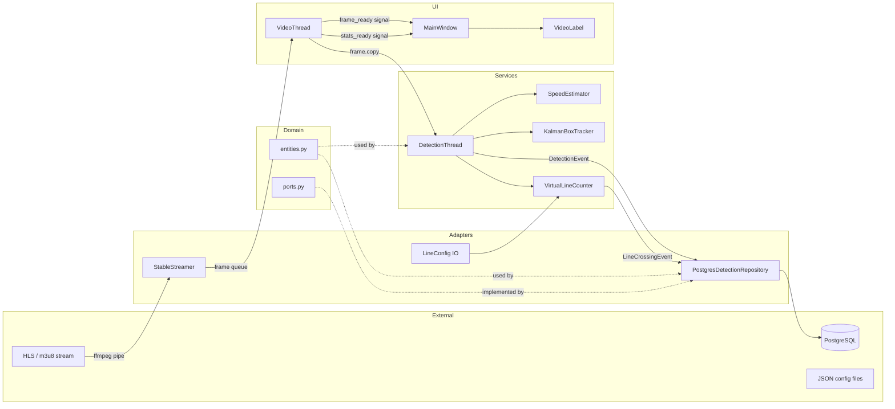
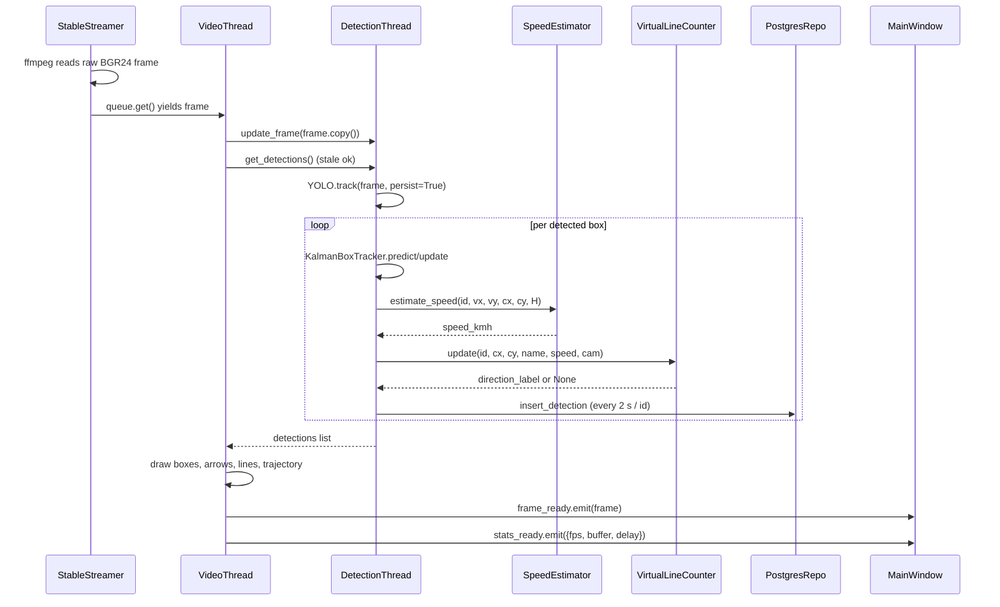
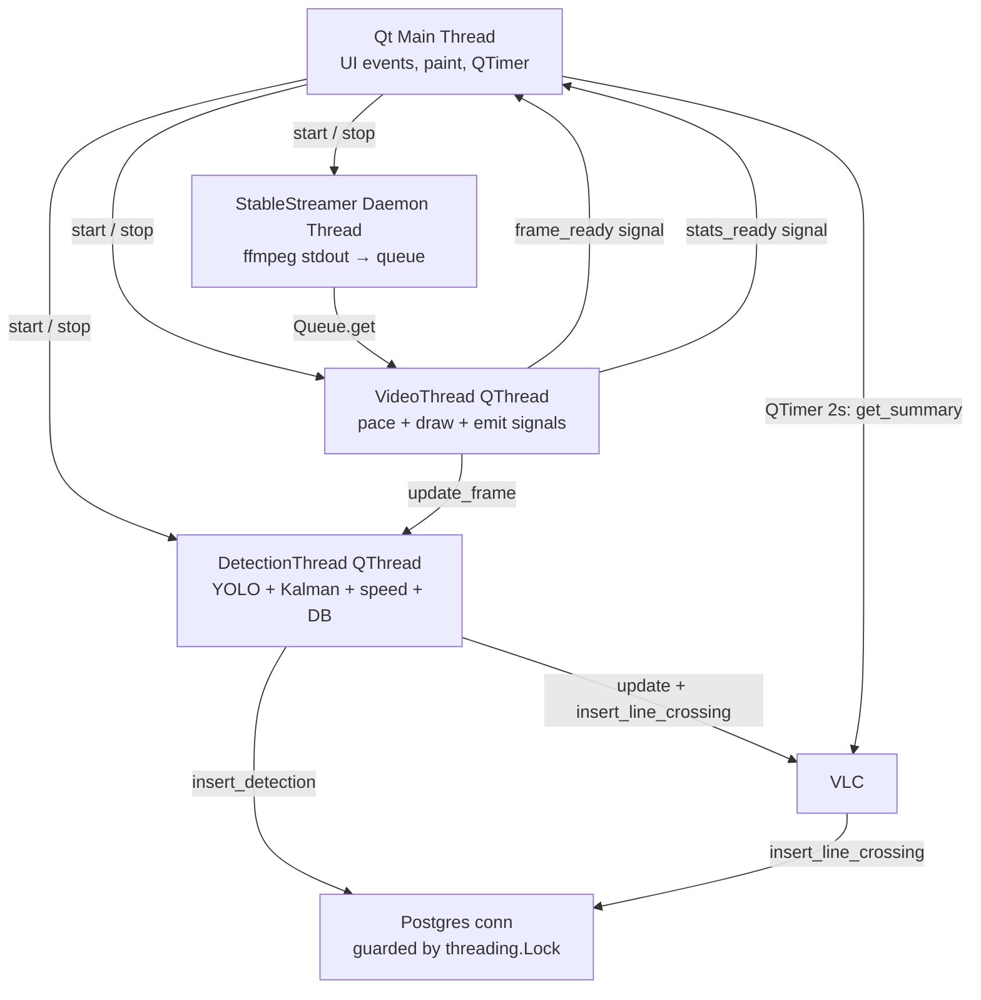
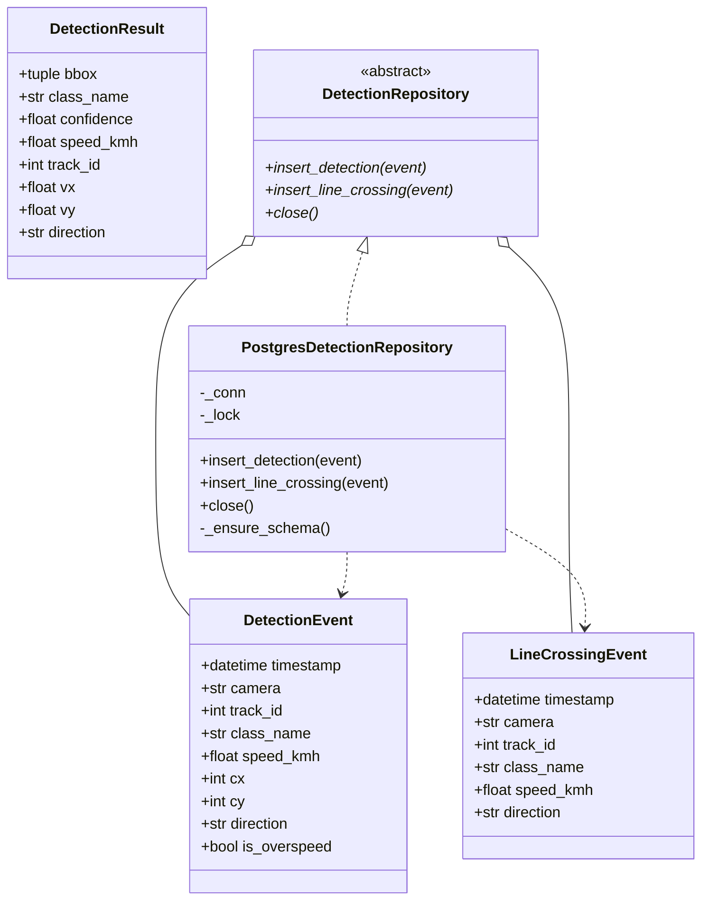

# TrafficSight — Design Document

> Architecture, layering, threading model, and data flow for maintainers.

---

## 1. Design Principles

1. **Hexagonal layering.** The `domain` package is pure: it imports
   nothing from `adapters`, `services`, or `ui`. Dependencies point inward.
2. **Configuration by environment.** No secrets or paths in source. The
   `config.py` module is the single source of truth and validates on import.
3. **One process, multiple threads.** The Qt main thread owns the UI; a
   `VideoThread` owns the render loop; a `DetectionThread` owns inference;
   a daemon thread inside `StableStreamer` owns ffmpeg stdout. Threads
   communicate via Qt signals and a single `queue.Queue`.
4. **Graceful degradation.** Every external dependency (stream up, model
   path, calibration file, DB) has a documented fallback. The app must
   boot and show *something* useful even if one is missing.
5. **Idempotent infrastructure.** Postgres schema, line-config JSON, and
   calibration JSON are created/merged — never clobbered — on startup.

## 2. High-Level Architecture



## 3. Layer Responsibilities

### 3.1 `domain/`

The innermost layer. Holds dataclasses (`DetectionEvent`,
`LineCrossingEvent`, `DetectionResult`) and the abstract
`DetectionRepository` port. **No I/O, no Qt, no cv2.** This is the only
layer an AI agent or a headless CLI needs to import.

### 3.2 `adapters/`

Implementations of the domain ports plus low-level I/O.

| Module                     | Responsibility                                            |
|----------------------------|-----------------------------------------------------------|
| `streamer.py`              | Spawn ffmpeg, read raw BGR24 frames, reconnect on EOF     |
| `postgres_repository.py`   | psycopg2 connection, schema bootstrap, insert methods     |
| `line_config.py`           | Load/save `counting_lines.json` keyed by stream URL       |

Adapters may import `domain` and `config`, but never `services` or `ui`.

### 3.3 `services/`

Stateful business logic that orchestrates adapters but is unaware of Qt
(except `DetectionThread`, which inherits `QThread` because Qt's thread
affinity makes that the simplest choice — see
[§5 — Threading Model](#5-threading-model)).

| Module            | Responsibility                                                          |
|-------------------|-------------------------------------------------------------------------|
| `tracking.py`     | Per-frame YOLO inference, Kalman update, speed + direction dispatch    |
| `geospatial.py`   | Homography-based speed estimation with perspective fallback            |
| `kalman.py`       | 8-state Kalman filter for bbox (cx, cy, w, h, vx, vy, vw, vh)          |
| `line_counter.py` | Virtual line crossing detection + per-arm directional counts           |

Services may import `domain`, `adapters`, and `config`. They must not
import `ui`.

### 3.4 `ui/`

PyQt6 widgets and threads. Only this layer may create `QApplication`,
emit signals, or paint pixels.

| Module              | Responsibility                                                  |
|---------------------|-----------------------------------------------------------------|
| `main_window.py`    | Top-level layout, metric cards, log table, button handlers     |
| `video_label.py`    | `QLabel` subclass that maps mouse drags to counting-line edits |
| `video_thread.py`   | Paced render loop, overlay drawing, trajectory mask            |
| `theme.py`          | Centralised QSS stylesheet                                      |
| `fps_detector.py`   | `ffprobe` wrapper                                               |

### 3.5 `tools/`

Standalone scripts that share config and adapters but are not part of
the runtime app.

| Module                            | When to run                              |
|-----------------------------------|------------------------------------------|
| `geospatial_calibration_gui.py`   | Once per camera, to produce the JSON     |
| `migrate_sqlite_to_postgres.py`   | Once, when migrating from a legacy install |

## 4. Data Flow — Frame Lifecycle



Key invariants:

- `VideoThread` **never blocks** on inference. It always pulls the latest
  `detections` snapshot from `DetectionThread`, even if inference is one
  or two frames behind.
- `DetectionThread` **drops stale frames**: if a new frame arrives before
  the previous one finished inference, the previous one is discarded.
- `PostgresRepo` writes are throttled to one row per `track_id` per 2 s
  to avoid write amplification under heavy traffic.
- `VirtualLineCounter` mutations are guarded by a `threading.Lock` because
  it is read by both `DetectionThread` (writes) and `MainWindow` (reads
  via `get_summary` on a QTimer).

## 5. Threading Model



| Thread                     | Owns                                         | Never does                                       |
|----------------------------|----------------------------------------------|--------------------------------------------------|
| Qt main                    | All widgets, signals, QTimer, QApplication   | Blocking I/O, cv2 inference                      |
| VideoThread (QThread)      | Render pacing, drawing, trajectory mask      | Direct widget mutation (only via signals)        |
| DetectionThread (QThread)  | YOLO model, Kalman trackers, repo handle     | QPixmap, QLabel, any Qt widget                   |
| Streamer daemon            | ffmpeg subprocess, raw frame queue           | Decode logic, drawing                            |

`DetectionThread` inherits `QThread` for two reasons: (1) it must emit
signals when inference state changes (planned), and (2) Qt's thread
affinity makes `QThread` the simplest way to integrate with the event
loop. The actual heavy lifting (YOLO, Kalman) is plain Python and could
be lifted into a headless worker if a CLI mode is added.

## 6. Domain Model



`DetectionResult` is an in-process value object (not persisted) used to
ship per-frame detection state from `DetectionThread` to `VideoThread`.

## 7. Configuration Surface

`config.py` exposes a single `Config` dataclass populated from
environment variables, validated at import time. Modules consume it via
direct import (`from trafficsight.config import cfg`). The shape:

```python
@dataclass(frozen=True)
class Config:
    base_dir: Path
    log_file: Path
    database_url: str
    model_path: Path
    stream_urls: dict[str, str]
    default_stream_name: str
    width: int
    height: int
    fallback_fps: float
    overspeed_kmh: float
    speed_cap_kmh: float
    buffer_seconds: int
    lines_file: Path
    geospatial_calib_file: Path
    default_counting_lines: dict[str, dict]
```

Validation rules enforced at startup:

- `database_url` starts with `postgresql://` or `postgres://`.
- `model_path` exists on disk **or** prints a warning and continues (so
  the UI can boot for camera-preview-only mode).
- `width` and `height` are positive integers ≤ 7680.
- `fallback_fps` is in `(1.0, 120.0)`.
- `overspeed_kmh < speed_cap_kmh`.
- `stream_urls` is non-empty and `default_stream_name` is one of its keys.

## 8. Persistence Schema

See [`README.md` § Database](../README.md#database) for the SQL DDL.
Design notes:

- **`detections` is a sampling table.** One row per `track_id` per ~2 s.
  It is not a per-frame log; treat it as a statistical sample.
- **`line_crossings` is an event log.** One row per actual crossing; no
  sampling.
- `is_overspeed` is denormalised for query convenience; it is derived
  from `speed_kmh > overspeed_kmh` at write time. If the threshold is
  later changed, historical rows are **not** recomputed — store the
  threshold alongside the row if audit-grade correctness is required.
- Indexes are intentionally minimal in v1; once a TimescaleDB migration
  lands (see [`GOALS.md`](GOALS.md) §8), `timestamp` will become the
  hypertable partition key.

## 9. Geospatial Calibration

The homography pipeline:

```mermaid
flowchart LR
    P[4 source points<br/>on CCTV frame] --> H[4 dest points<br/>on bird's-eye plane]
    H --> M[cv2.getPerspectiveTransform]
    M --> JSON[geospatial_calibration.json]
    JSON --> SE[SpeedEstimator._load_calibration]
    SE --> PT[cv2.perspectiveTransform<br/>applied to (cx, cy) and (cx+vx, cy+vy)]
    PT --> DX[dx_m = Δx_world / ppm_x]
    PT --> DY[dy_m = Δy_world / ppm_y]
    DX --> S[speed = √(dx² + dy²) × fps × 3.6]
    DY --> S
    S --> EMA[EMA smoothing<br/>0.35·new + 0.65·prev]
    EMA --> CAP[min(speed, 140)]
    CAP --> OUT[speed_kmh]
```

Fallback (no calibration file): a perspective heuristic assumes the
horizon is at `y=200` and linearly interpolates `ppm` from `1/0.4` (near)
to `1/0.02` (far). This produces *relative* speeds only.

## 10. Extensibility Points

| You want to…                  | Touch…                                                  | Don't touch…              |
|-------------------------------|---------------------------------------------------------|---------------------------|
| Add a new storage backend     | New class in `adapters/`, register in a factory         | `services/`, `ui/`        |
| Add a new counting arm        | `config.default_counting_lines`, `line_counter._resolve_event` | DB schema              |
| Plug a different detector     | New `DetectorThread` subclass implementing `update_frame`/`get_detections` | `ui/`            |
| Replace YOLO with another model | `DetectionThread.run`'s model load + inference block   | Domain, adapters          |
| Add a web UI                  | New top-level package reading from Postgres             | Anything in `trafficsight/` |
| Add an AI agent               | See [`AGENT.md`](AGENT.md) — only consumes `domain` + `adapters` | UI, services internals |

## 11. Known Limitations

1. `DetectionThread` is hard-wired to `PostgresDetectionRepository`. DI
   is supported via the constructor but the default factory still picks
   Postgres. A `--repo` CLI flag is on the v1.1 roadmap.
2. `commit()` is called per insert. Under >40 vehicles this becomes a
   bottleneck; batching is planned.
3. The trajectory mask is per-session only; long sessions accumulate
   paint and obscure the background. A periodic fade is planned.
4. The calibration GUI hard-codes the Sugeng Jeroni stream URL. The
   `tools/` script accepts a `--stream` flag, but the GUI does not yet
   expose a dropdown.
5. Tests stub the repository but do not exercise the full
   `DetectionThread` loop with a recorded video — that integration test
   is left as a contribution opportunity.

## 12. Glossary

- **Arm** — One of the four counting lines (Utara / Selatan / Barat /
  Timur) named after the cardinal direction it faces.
- **Bird's-eye view** — Top-down projection of the camera frame produced
  by the homography.
- **Crossing** — A track's centroid passing through a counting line. Each
  (track_id, arm) pair is counted at most once.
- **ppm** — Pixels per meter in the bird's-eye view.
- **Track ID** — A persistent integer assigned by YOLO/ByteTrack to a
  single physical vehicle across consecutive frames.
- **Trajectory mask** — A persistent overlay image that accumulates line
  segments between consecutive centroids, producing a heat-map-like trail
  of where vehicles have moved.
